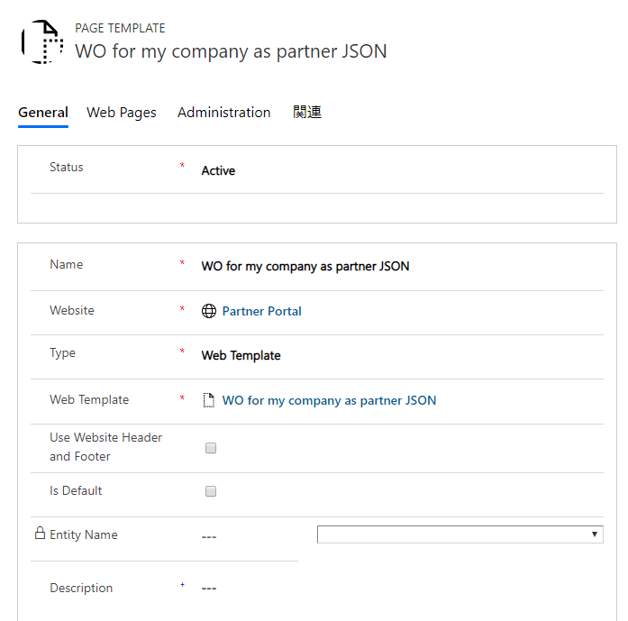
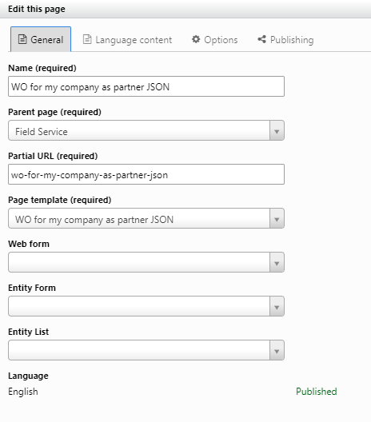
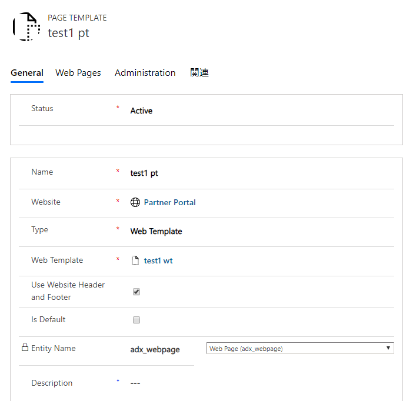
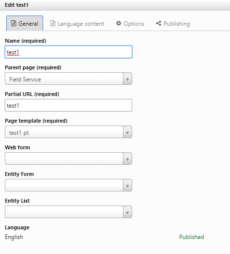
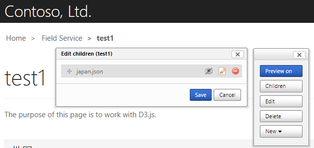
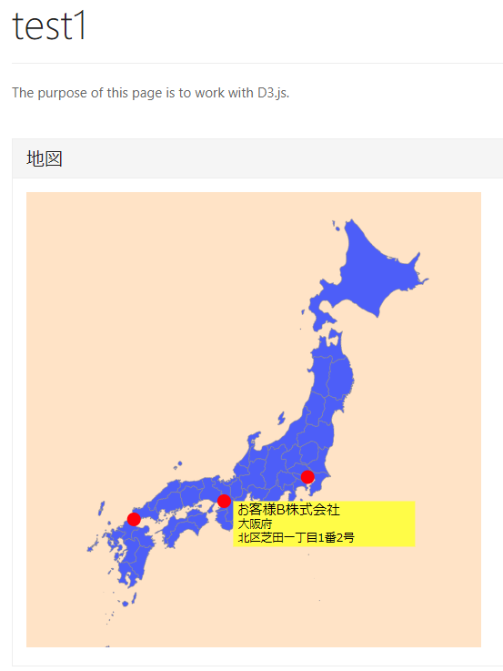
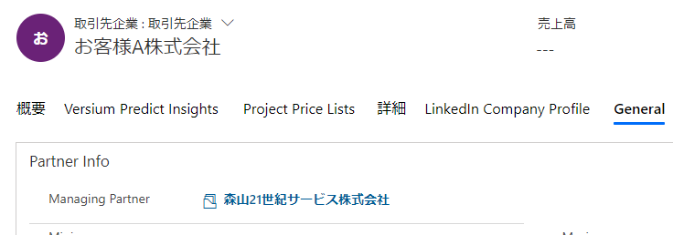

# D365CEPortalCustomJSOND3Map
D365 CE Portal にて、カスタム JSON を利用する Tips の紹介として、ポータル上に D3.js による地図を表示し、データの緯度経度上にピンを置くサンプルをその手順と共に紹介します。  
なお、D365 CE Portal の種類は パートナー ポータルを利用している例です。  

## ポータル上での構成
1. JSON データを出力するページ
  1. Web Template の作成  
  ここでは、"WO for my company as partner JSON" という名前で作成しました。  
  MIME Type は "application/plain" とします。  
  ソースには以下のように入力します。ここでは、取引先企業エンティティのデータを取得するサンプルです。なお、緯度、経度の各々のフィールドには適切な値が入っていることを想定しています。  
  ```
  
  <fetch version="1.0" output-format="xml-platform" mapping="logical" distinct="false" returntotalrecordcount="true">
    <entity name="account">
      <attribute name="name" />
      <attribute name="telephone1" />
      <attribute name="accountid" />
      <attribute name="address1_stateorprovince" />
      <attribute name="address1_city" />
      <attribute name="address1_line1" />
      <attribute name="address1_longitude" />
      <attribute name="address1_latitude" />
      <attribute name="address1_composite" />
      <order attribute="name" descending="false" />
      <filter type="and">
        <condition attribute="statecode" operator="eq" value="0" />
        <filter type="and">
          <condition attribute="address1_latitude" operator="not-null" />
          <condition attribute="address1_longitude" operator="not-null" />
        </filter>
      </filter>
    </entity>
  </fetch>
  {
    "totalcount": {{ wo_query.results.total_record_count }},
    "morerecords": {{ wo_query.results.more_records }},
    "page": {{ request.params['page'] | default: 0 }},
    "results": [
      
        {
          "name": "{{ record.name }}",
          "stateorprovince": "{{ record.address1_stateorprovince }}",
          "city": "{{ record.address1_city }}",
          "line1": "{{ record.address1_line1 }}",
          "lat": {{ record.address1_latitude }},
          "long": {{ record.address1_longitude }}
        },
      
    ]
  }
  ```

  1. 上記の Web Template を利用する Page Template を作成します。   
    

  1. /FieldService/ の子ページを作成します。  
  上記 Page Template を利用するページを作成します。  
  /FieldService/wo-for-my-company-as-partner-json/ というアドレスでアクセスできます。  
    

1. 地図を表示するページ  
  1. Web Template の作成  
  ここでは、"test1 wt" という名前で作成しました。  
  MIME Type は "" とします。  
  ソースには以下のように入力します。  
  ```
  
  
  
  
  
  
  <div class="child-navigation content-panel panel panel-default">
      <div class="panel-heading">
          <h4>地図</h4>
      </div>
      <div class="panel-body">
  <!--        <script src="https://code.jquery.com/jquery-3.4.1.min.js"></script> -->
          <script src="https://cdnjs.cloudflare.com/ajax/libs/topojson/3.0.2/topojson.min.js"></script>
  
          <script src="https://d3js.org/d3.v5.min.js"></script>
          <script type="text/javascript">
  
              // グローバル ネームスペース
              var MY = MY || {};
  
              MY.init = function () {
                  // DEBUG
                  // var wo_data = {
                  //     "totalcount": 2,
                  //     "morerecords": false,
                  //     "page": 0,
                  //     "results": [
                  //         {
                  //             "name": "DEBUG お客様A株式会社",
                  //             "stateorprovince": "Tokyo",
                  //             "city": "Shinjuku-ku",
                  //             "line1": "",
                  //             "lat": 35.68999,
                  //             "long": 139.71426
                  //         },
                  //         {
                  //             "name": "DEBUGお客様B株式会社",
                  //             "stateorprovince": "Osaka",
                  //             "city": "Kita-ku",
                  //             "line1": "",
                  //             "lat": 34.69858,
                  //             "long": 135.50461
                  //         }
                  //     ]
                  // };
                  // MY.showMap(wo_data);
  
                  MY.showMap();
  
              };
  
              // 日本地図を表示する
              // DEBUG 以外では引数 wo_data は不要。
              MY.showMap = function (wo_data) {
                  $.get("/FieldService/test1/japan.json/", function (_data) {
                      // console.log("japan.json: ");
                      // console.dir(_data);
  
                      MY.TopoJSON_Japan = _data;
                  }).done(function () {
                      // console.dir(MY.TopoJSON_Japan);
  
                      var b_width = 1000;
                      var b_height = 1000;
  
                      var svg = d3.select("#MainSVG")
                          .attr("viewBox", "0 0 " + b_width + " " + b_height);
  
                      var projection = d3.geoMercator()
                          .center([137, 38])
                          .scale(2500)
                          .translate([b_width / 2, b_height / 2]);
  
                      var path = d3.geoPath()
                          .projection(projection);
  
                      var features = topojson.feature(MY.TopoJSON_Japan, MY.TopoJSON_Japan.objects.pref).features;
                      svg.selectAll(".pref")
                          .data(features)
                          .enter()
                          .append("path")
                          .attr("class", (d, index) => { return "pref pref" + index; })
                          .attr("d", path);
  
                      $.get("/FieldService/wo-for-my-company-as-partner-json/", function (_data) {
                          var wo_data = JSON.parse(_data);
                          MY.showWOs(wo_data);
                      });
  
                  });
              };
  
              // 地図上に作業指示書のデータを表示する。
              // wo_data は JSON からオブジェクト化されたオブジェクト
              MY.showWOs = function (wo_data) {
                  // console.dir(wo_data);
                  var wo_array = wo_data.results;
  
                  var svg = d3.select("#MainSVG");
  
                  var projection = d3.geoMercator()
                      .center([137, 38])
                      .scale(2500)
                      .translate([1000 / 2, 1000 / 2]);
  
                  //wo_array の中身に、prjection に合わせて座標の x y 要素を追加する
                  for (var i = 0; i < wo_array.length; i++) {
                      var wo = wo_array[i];
                      var xy = projection([wo.long, wo.lat]);
                      wo["x"] = xy[0];
                      wo["y"] = xy[1];
                  }
                  // console.dir(wo_array);
  
                  svg.selectAll("circle")
                      .data(wo_array)
                      .enter()
                      .append("circle")
                      .attr("cx", (d) => { return d.x; })
                      .attr("cy", (d) => { return d.y; })
                      .attr("r", 15)
                      .attr("class", "wo")
                      .on("mouseover", (wo) => {
                          $("#InfoText1").text(wo.name);
                          $("#InfoText2").text(wo.stateorprovince);
                          $("#InfoText3").text(wo.city);
  
                          d3.select("#InfoG")
                              .attr("transform", "translate(" + (wo.x + 20) + " " + wo.y + ")")
                              .style("visibility", "visible");
                      })
                      .on("mouseout", () => {
                          d3.select("#InfoG")
                              .style("visibility", "hidden");
                      });
  
                  // SVG要素として最前面に持ってくる
                  $("#InfoG").appendTo("#MainSVG");
              };
  
              MY.init();
  
          </script>
          <svg id="MainSVG" width="500" height="500" xmlns="http://www.w3.org/2000/svg"
              xmlns:xlink="http://www.w3.org/1999/xlink" xmlns:ev="http://www.w3.org/2001/xml-events">
              <g id="InfoG" style="visibility: hidden;">
                  <rect x="0" y="0" width="400" height="100" fill="yellow"></rect>
                  <text id="InfoText1" x="10" y="30" font-family="Meiryo UI" font-size="30" fill="black">〇〇〇株式会社</text>
                  <text id="InfoText2" x="10" y="60" font-family="Meiryo UI" font-size="25" fill="black">東京都</text>
                  <text id="InfoText3" x="10" y="90" font-family="Meiryo UI" font-size="25" fill="black">新宿区新宿1</text>
              </g>
          </svg>
      </div>
  </div>
  <style type="text/css">
      .pref {
          fill: #5555FF;
          stroke: #888888;
          stroke-width: 1px;
      }
  
      svg {
          background-color: bisque;
      }
  
      .wo {
          fill: red;
      }
  </style>
  
  
  ```

  1. 上記の Web Template を利用する Page Template を作成します。   
    

  1. /FieldService/ の子ページ test1 を作成します。  
  上記 Page Template を利用するページを作成します。  
  /FieldService/test1/ というアドレスでアクセスできます。この時点でこのページを表示しても正しく表示されません。  
    

  1. 地図データをポータル上にアップロード  
  後述の[地図データの準備](#preparemap)の章にて、japan.json を準備ください。  
  その japan.json を /FieldService/test1/ ページの子ファイルとしてアップロードします。  
  これにより、/FieldService/test1/japan.json/ というパスにてアクセスできるようになります。  
    

  1. 動作を確認  
  パートナー企業に勤めるユーザー アカウントとして、ポータルにサインインし、/FieldService/test1/ ページにアクセスします。以下のように地図が表示され、緯度経度上に印が表示され、マウスをホバーすると情報が表示されます。  
  

## データの準備
D365 パートナー ポータル として適切な構成が必要です。エンティティのアクセス許可、Web ロールなども含まれます。  
その中には例えば、上記の例では、お客様としての取引先企業レコードの Managing Partner フィールドには適切なパートナー企業レコードの値が入っており、このパートナー企業に属するユーザー アカウントとしてポータルにサインインする必要がある、ということが含まれます。  
  

## 地図データの準備 <a name="preparemap"></a>
以下のページの記載などを参考に、日本地図のデータを TopoJSON 形式で、japan.json ファイルとして用意する。  
  - https://qiita.com/ran/items/d88c5126362576be3291
